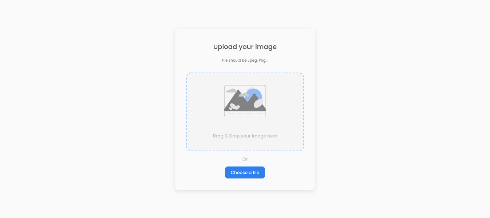

<h1 align="center">Image Uploader | JRS-Developer</h1>

<div align="center">
   Solution for a challenge from  <a href="http://devchallenges.io" target="_blank">Devchallenges.io</a>.
</div>

<div align="center">
  <h3>
    <a href="https://upload-image-omega.vercel.app/" target="_blank">
      Demo
    </a>
    <span> | </span>
    <a href="https://devchallenges.io/solutions/QwfBu1C7AdJeZuT0moXk">
      Solution
    </a>
    <span> | </span>
    <a href="https://devchallenges.io/challenges/O2iGT9yBd6xZBrOcVirx" target="_blank">
      Challenge
    </a>
  </h3>
</div>

<!-- TABLE OF CONTENTS -->

## Table of Contents

- [Overview](#overview)
  - [Built With](#built-with)
- [Features](#features)
- [How to use](#how-to-use)
- [Acknowledgements](#acknowledgements)
- [Contact](#contact)

<!-- OVERVIEW -->

## Overview



I made this project as a practice to get started with NextJs, the web is deployed in [Vercel](https://vercel.com) and you can see the demo [here](https://upload-image-omega.vercel.app/).
I had already experience working with NodeJs and React but I wanted to make the next step and try NextJs. And I think this was a good project to get started.

Doing the project I learnt a lot about how to work with NextJs with the API routes and with some features like the document component.

### Built With

<!-- This section should list any major frameworks that you built your project using. Here are a few examples.-->

- [NextJs](https://nextjs.org/)
- [React](https://reactjs.org/)
- [Tailwind](https://tailwindcss.com/)

## Features

<!-- List the features of your application or follow the template. Don't share the figma file here :) -->

This application/site was created as a submission to a [DevChallenges](https://devchallenges.io/challenges) challenge. The [challenge](https://devchallenges.io/challenges/O2iGT9yBd6xZBrOcVirx) was to build an application to complete the given user stories.

- **User story**: I can drag and drop an image to upload it
- **User story**: I can choose to select an image from my folder
- **User story**: I can see a loader when uploading
- **User story**: When the image is uploaded, I can see the image and copy it
- **User story**: I can choose to copy to the clipboard

## How To Use

<!-- Example: -->

To clone and run this application, you'll need [Git](https://git-scm.com), [Node.js](https://nodejs.org/en/download/) (which comes with [npm](http://npmjs.com)) installed on your computer and a [Cloudinary](https://cloudinary.com/) account. From your command line:

```bash
# Clone this repository
$ git clone https://github.com/your-user-name/your-project-name

# Install dependencies
$ yarn install

# Run development mode
$ yarn run dev
```

**Be sure to create an env.local file and add your CLOUDINARY_URL**

## Acknowledgements

<!-- This section should list any articles or add-ons/plugins that helps you to complete the project. This is optional but it will help you in the future. For example -->

- [NextJs](https://nextjs.org)
- [Indeterminate animation](https://codepen.io/holdencreative/pen/pvxGxy) _This helped me a lot to make the indeterminate animation of the uploading progress bar_

## Contact

- Website [jrs-developer.github.io](https://jrs-developer.github.io/)
- GitHub [@JRS-Developer](https://github.com/JRS-Developer/)
- Twitter [@joserafa_s](https://twitter.com/joserafa_s)
- Linkedin [@jose-jrs](https://www.linkedin.com/in/jose-jrs)
